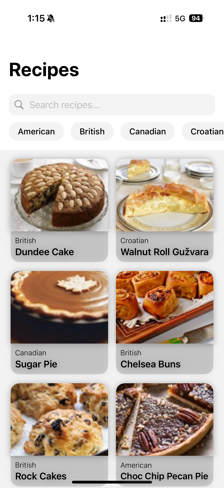
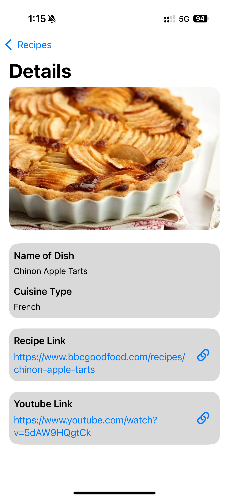
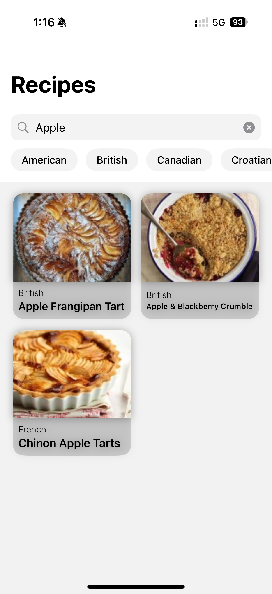
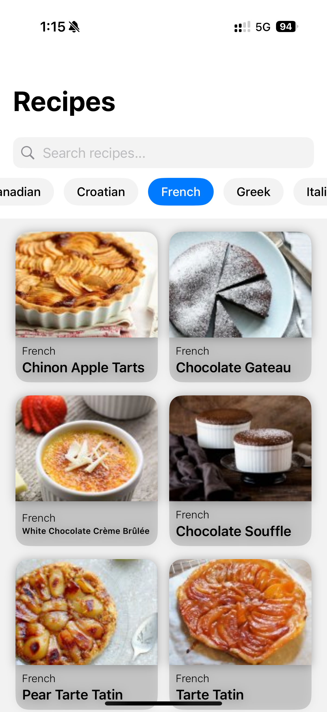
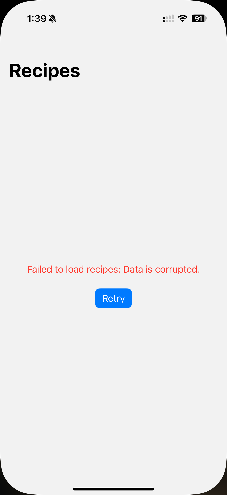
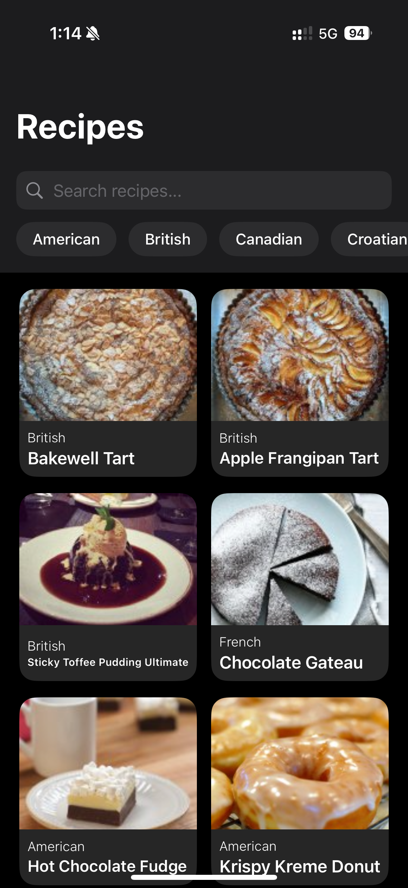
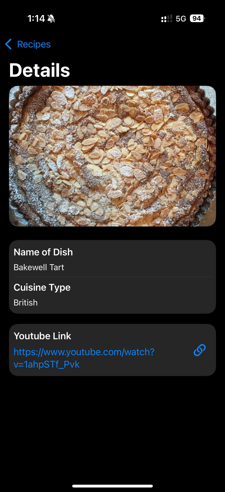
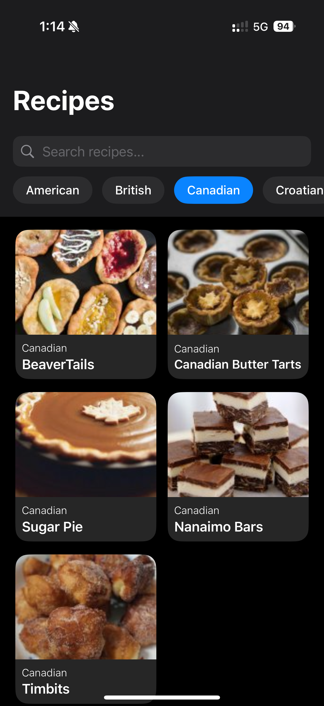
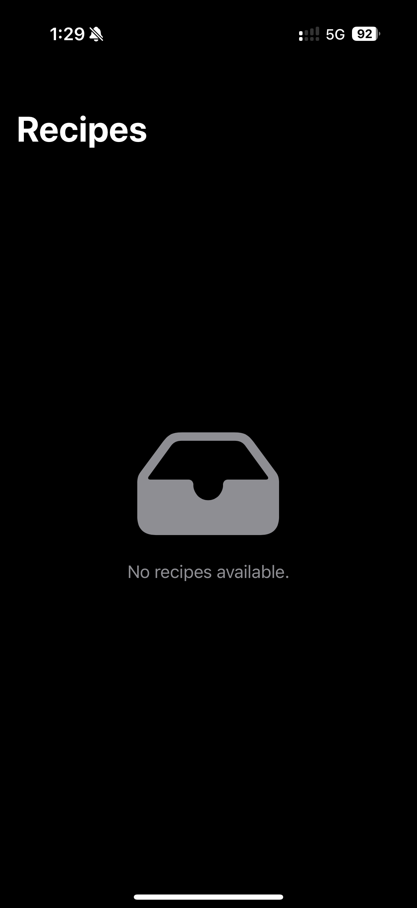
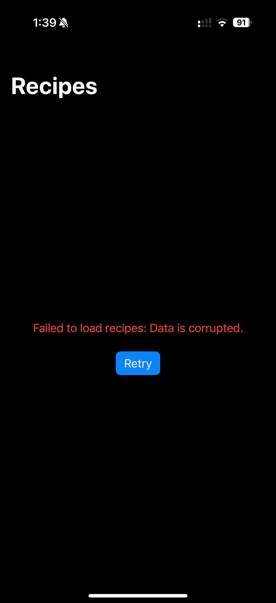

# Fetch Take Home Project.

### Focus Areas: What specific areas of the project did you prioritize? Why did you choose to focus on these areas?

I prioritized building a reliable and responsive data-fetching mechanism using Swift Concurrency and ensuring the app could gracefully handle malformed JSON data. I focused on these areas because the app’s core functionality depended on retrieving and displaying accurate information, and I wanted to ensure a smooth user experience. Additionally, I prioritized a clean, intuitive UI with SwiftUI to make the app easy to navigate while maintaining efficient performance. These elements were fundamental to meeting the project requirements and demonstrating best practices in concurrency and data handling.

### Time Spent: Approximately how long did you spend working on this project? How did you allocate your time?

I spent about 12 hours working on this project. I started by planning the app structure and understanding the requirements, then focused most of my time on implementing the SwiftUI interface and integrating Swift Concurrency for efficient JSON data handling. I dedicated time to managing potential issues with malformed JSON and wrote unit tests to validate concurrency functions. Lastly, I reviewed and optimized the code for clarity and performance.

### Trade-offs and Decisions: Did you make any significant trade-offs in your approach?

Yes, I made a trade-off by prioritizing functionality and performance over advanced UI animations. While I focused on implementing efficient JSON data handling, concurrency, and error management, I chose to keep the UI design clean and straightforward rather than investing significant time in animations or complex visual elements. This decision allowed me to ensure the app’s core features were robust and performant

### Weakest Part of the Project: What do you think is the weakest part of your project?

The weakest part of my project was initially implementing image caching. I wasn’t familiar with the best practices for caching images efficiently, which led to some performance challenges. However, I took the time to research and learn more about caching techniques, and I was eventually able to implement a solution that improved the app's performance. It was a valuable learning experience that helped me deepen my understanding of image handling in Swift.

### Additional Information: Is there anything else we should know? Feel free to share any insights or constraints you encountered.

One key insight from this project was the challenge I faced with image caching. Initially, I wasn't familiar with efficient caching techniques, which impacted performance when loading images. However, I took the initiative to research best practices and successfully implemented a solution that improved the app's responsiveness. Additionally, working with Swift Concurrency to handle JSON data and manage errors provided a valuable learning experience. Overall, the project helped me grow as a developer by reinforcing the importance of performance optimization and robust error handling.

## App Screenshots

### Main View

### Detail View

### Search Bar View

### Filter View

### Empty State View

### Malformed View

## App Screenshots - Dark Mode

### Dark Mode - Main View

### Dark Mode - Detail View

### Dark Mode - Search Bar

### Dark Mode - Filter

### Dark Mode - Empty State View

### Dark Mode - Malformed View

